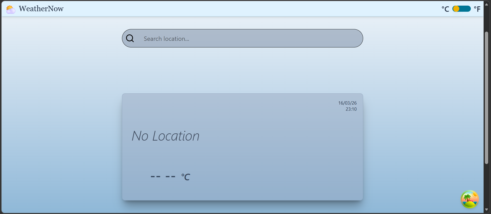
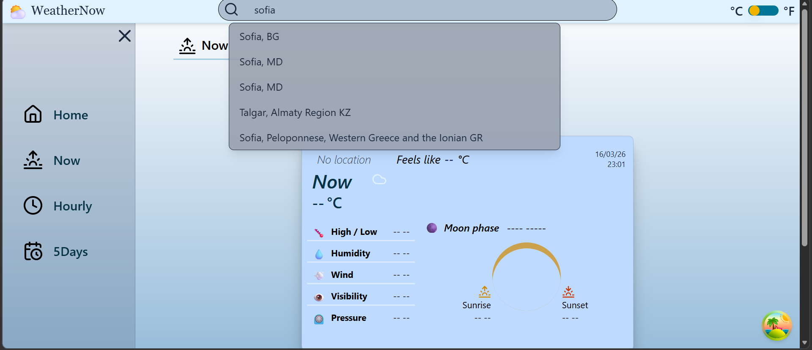
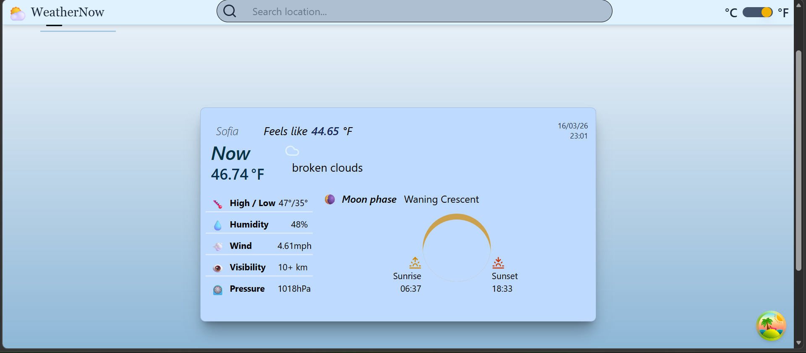
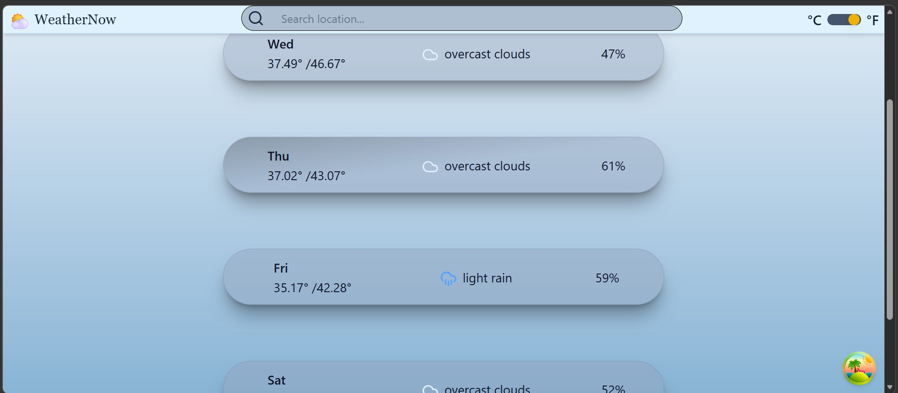
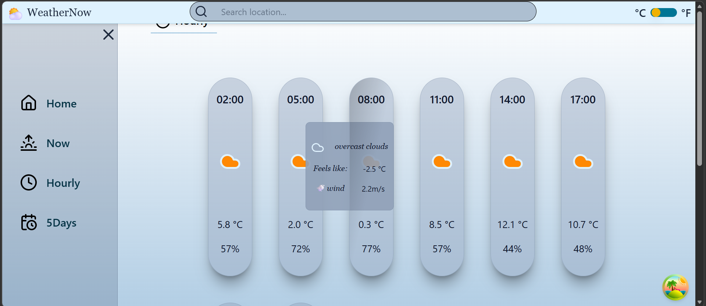

# 🌤 Weather App

Modern weather application built with React.js, React Query and Tailwind CSS.
It provides real-time weather data, hourly forecast, and 5-day forecast using OpenWeatherMap API.

---

## 🚀 Live Demo

🔗 [View Live Website](YOUR_DEPLOY_LINK_HERE)

---

## 📸 Screenshots

### 🏠 Home Page


### 🏠 Choose location 


### 🏠 Now Page


### 📅 5-Day Forecast


### 🕒 Hourly Forecast


---

## ✨ Features

- 🔎 City search with autocomplete (Geocoding API)
- 🌡 Current weather
- 🕒 3-hour forecast
- 📅 5-day forecast
- 🌍 Dynamic location selection
- 🌡 Celsius / Fahrenheit toggle
- ⚡ Smart caching with React Query
- 🚀 Optimized API fetching (single fetch per location)
- 📱 Fully responsive layout (mobile, tablet, desktop)
- 🎨 Adaptive UI that adjusts to different screen sizes

---

## 🛠 Tech Stack

- React
- React Router
- React Query (TanStack Query)
- Tailwind CSS
- OpenWeatherMap API
- Lucide Icons

---

## 🧠 Architecture

- Centralized weather fetching using custom hook
- Single fetch triggered by location change
- React Query caching & background updates
- Clean separation of data layer and UI layer

---

## 📄 License

This project is open-source and available under the MIT License.  
You are free to use, modify, and distribute this project.

---

## 📦 Installation

Clone the repository:

```bash
git clone https://github.com/YOUR_USERNAME/YOUR_REPO.git
cd YOUR_REPO
npm install
create .env
VITE_WEATHER_API_KEY=your_api_key_here
npm run dev
open http://localhost:5173


